# Assigment-5
In this assignment, an application with user login and showing musics was developed. The user signs up to the application with their email, password and username. In the application, the home page contains the latest music and some lists. On the search page, user can see musics by genres or search by music name himself. In addition, if desired, the music can be liked and users can see these music in the "Liked Songs" section of their profile. Finally, it can edit application and account settings.

## Used technologies
- Expo CLI
- React Native Navigation
- Redux Toolkit
- Firebase Authentication
- React Native Vector Icons
- React Native AsyncStorage
- Axios

## Screens
<div>
<kbd></kbd>
<kbd></kbd>
</div>
<div>
<kbd>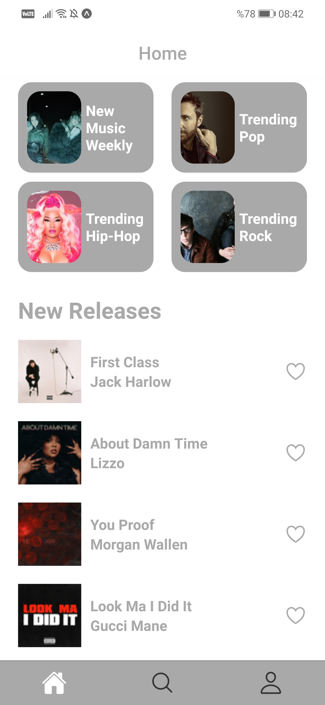</kbd>
<kbd>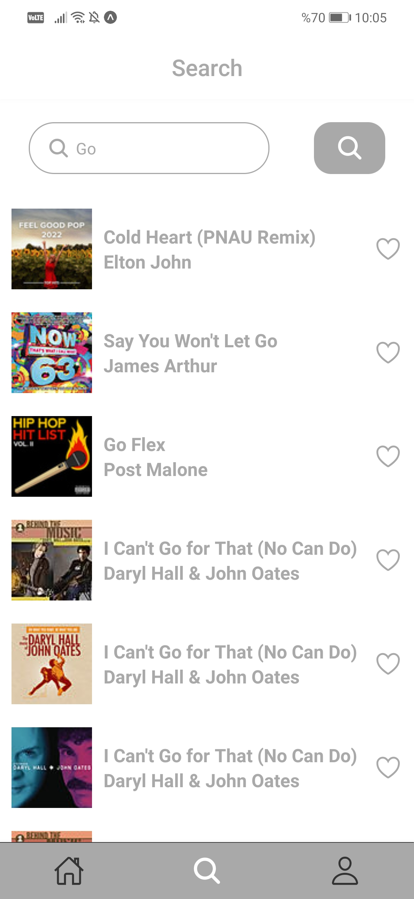</kbd>
<kbd>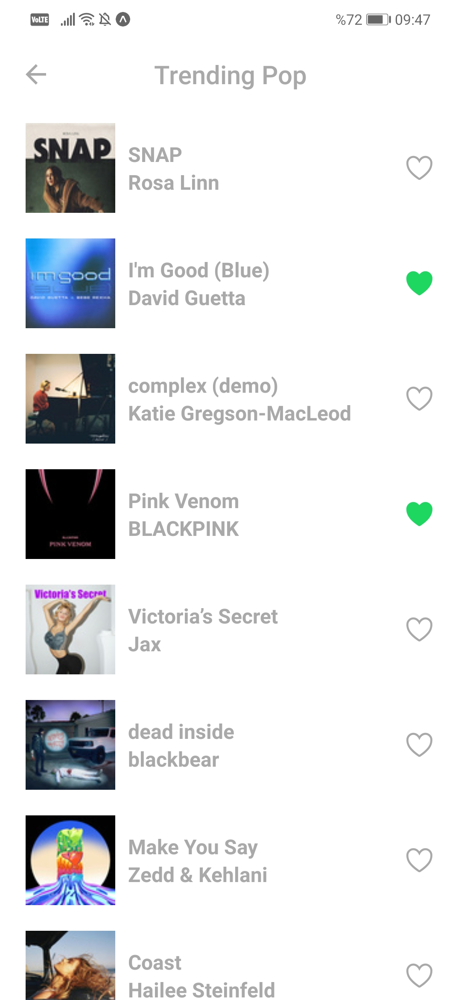</kbd>
</div>
<div>
<kbd>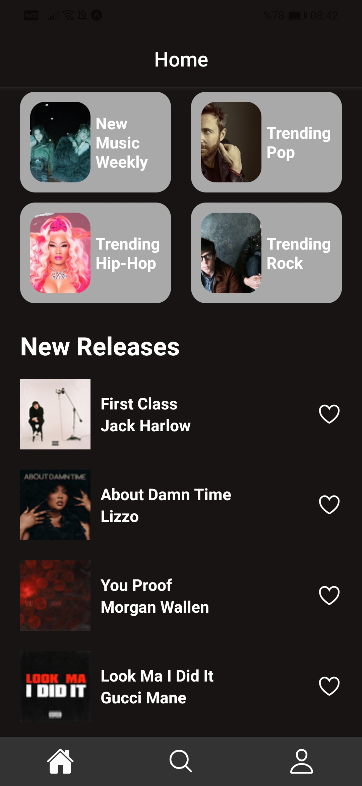</kbd>
<kbd>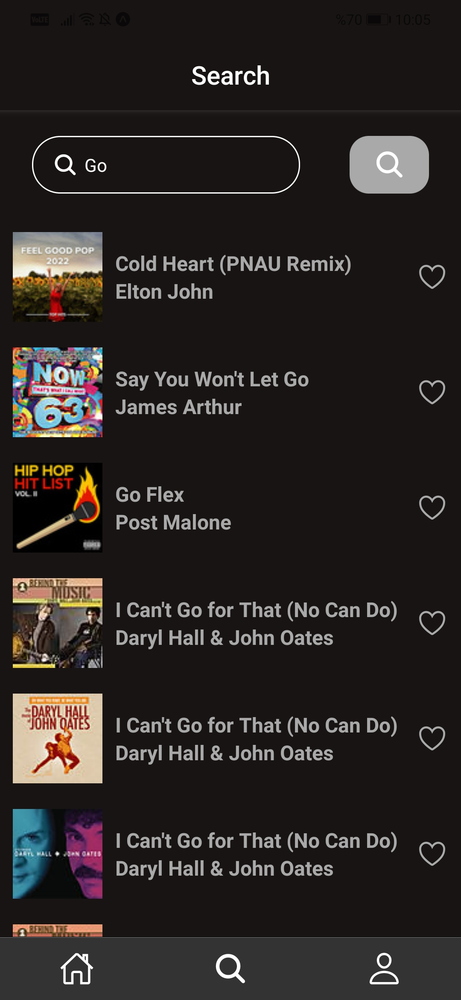</kbd>
<kbd>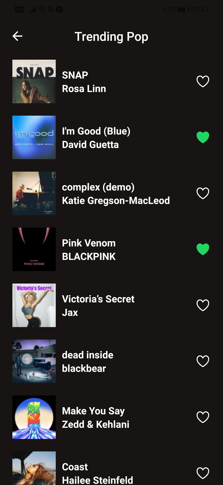</kbd>
</div>
<div>
<kbd>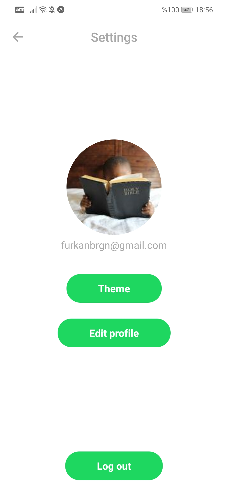</kbd>
<kbd>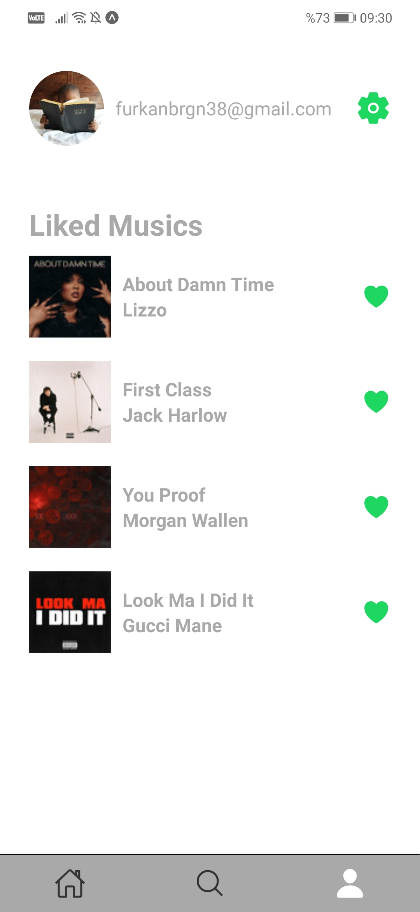</kbd>
<kbd>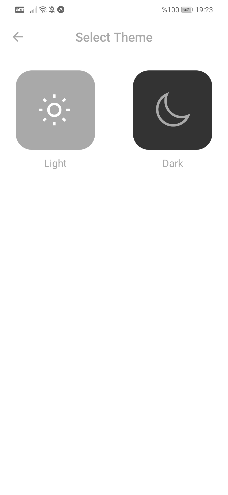</kbd>
</div>
<div>
<kbd>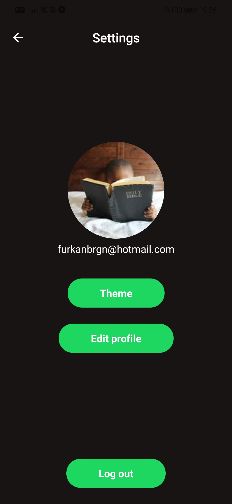</kbd>
<kbd>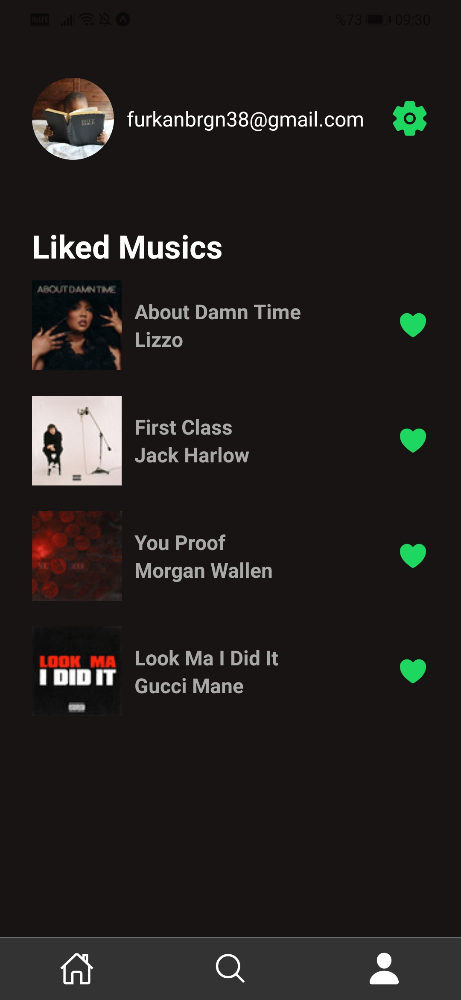</kbd>
<kbd>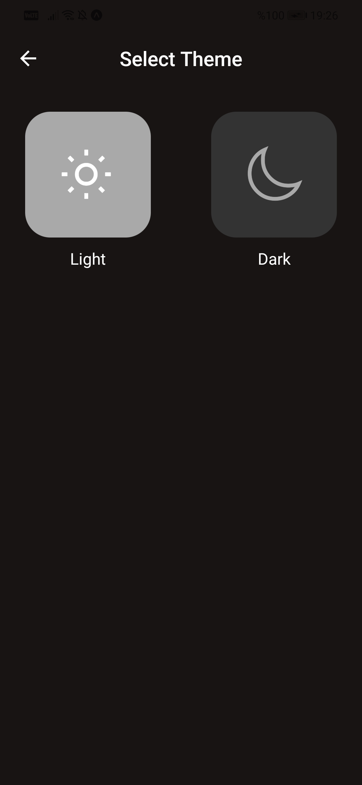</kbd>
</div>

## Installation
1.Clone Project
```
git clone https://github.com/patika-218-akbank-reactnative-bootcamp/assignment-5-furkanbagirgan.git
```
2.Install the Necessary Packages for Project
```
npm install
or
yarn install
```
3.Run Project To Emulator or Real Device
```
npx expo start & npx expo run:android | npx expo run:ios
or
yarn expo start & yarn expo run:android | yarn expo run:ios
```
